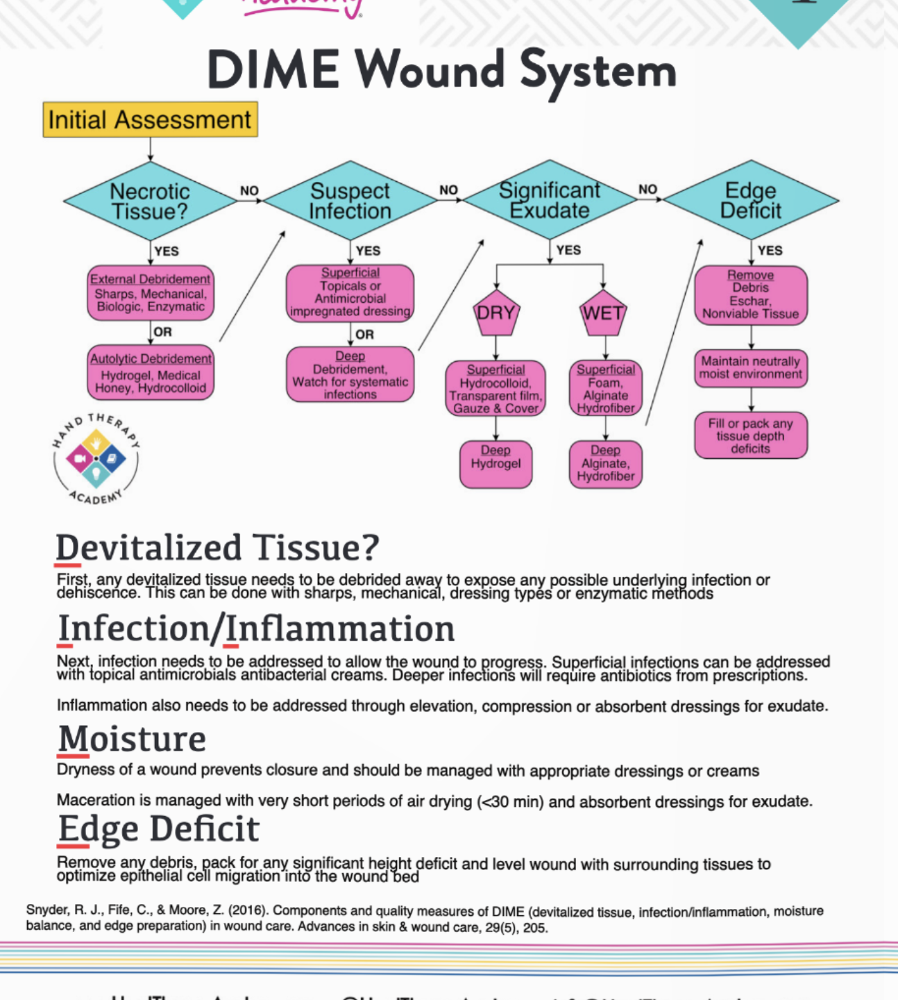

# Wound care basics

## Wound healing timelines

| Phase                            | Timeframe        | Key Cells Involved                                                                            | Primary Goal / Action                                  |
| -------------------------------- | ---------------- | --------------------------------------------------------------------------------------------- | ------------------------------------------------------ |
| **Hemostasis**                   | Immediate        | Platelets                                                                                     | Clotting & release of growth factors                   |
| **Inflammation**                 | Day 1 – 5        | Monocytes, macrophages, neutrophils                                                           | Cleaning via phagocytosis                              |
| **Proliferative / Fibroblastic** | Day 4 – 21       | Macrophages, pericytes, lymphocytes, angiocytes, fibroblasts, epithelial cells, keratinocytes | Fill defect; wound closure; re-establish skin function |
| **Maturation / Remodeling**      | Day 21 – 2 years | Fibroblasts, fibrocytes                                                                       | Develop tensile strength                               |

### Wound-Care Terms

- **Exudate** – Any draining fluid from the wound. It can be serous, sanguineous, serosanguinous, or purulent.
- **Serous** – Clean, thin, watery exudate; normal during the inflammatory phase.
- **Sanguineous** – Blood in a small amount; normal during the inflammatory phase. May leak from partial- or full-thickness wounds.
- **Serosanguinous** – The most common type of wound exudate; thin, pink, and watery in presentation.
- **Purulent** – Milky, typically thicker exudate that can appear gray, green, or yellow. Very thick purulence may indicate infection.
- **Hypergranulated Tissue** (hypergranulation tissue) – Red, beefy, or “proud” flesh indicating an over-active proliferative stage.
- **Eschar** – Necrotic tissue, usually black or brown. Can be hard/dry or soft/boggy/thick & leathery; non-viable and can be colonized by bacteria.
- **Maceration** – Wetness that can lead to whiteness and loss of skin integrity around wound margins.
- **Desiccation** – Drying of a wound that can result in splitting or cracking open.
- **Dehiscence** – Re-opening of a wound after initial closure; often due to stitches removed too early or excessive mechanical load.
- **Hydrophilic** – An area of a dressing that attracts moisture.
- **Hydrophobic** – An area of a dressing that repels moisture.
- **Occlusive Dressing** – A dressing that effectively blocks transfer of moisture and environmental contaminants.

## primary vs seocondary dressings

Primary dressing: Used directly on the wound.

Secondary dressing: Overlays the primary dressing: It is applied on top of the primary dressing to secure it in place and provide additional protection. It helps to keep the primary dressing in place, absorbs any extra fluid, and can provide added protection against infection or further injury.

## wound cleaning

Can be washed gently with soap and running water after 48 hours
Can be washed with saline solution

## DIME

## Produts to be used in the clinic

- Xeroform
- Telfa
- hydrofiber
